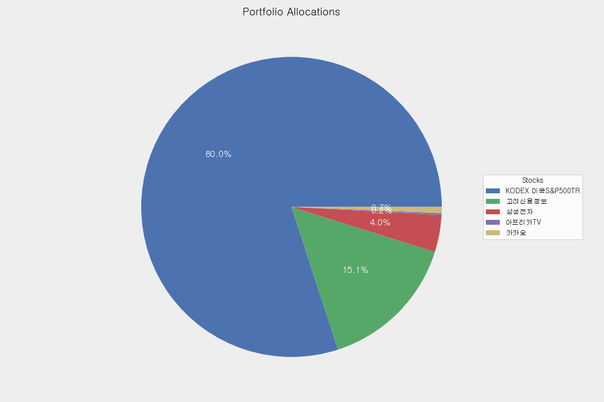

HUG-Portfolio Reports
=====================
  
 
# 

## 01. Portfolio Allocations (2015.1.1~2022.10.12)
  
   
**최적화된 포트폴리오의 샤프 비율, 시장 베타, 최대 손실폭은 다음과 같다.**  
   
1. The Sharpe Ratio of the backtest is (샤프 비율): 0.47  
2. The market beta of the backtest is (시장 베타): 0.7108  
3. The maxmimum drawdown of the backtest is (최대 손실폭): -0.427  
   
**현재 시점으로 보유 종목의 최적 배분은 다음과 같다.**
## 
|                    |   Allocations |     Balance |
|:-------------------|--------------:|------------:|
| KODEX 미국S&P500TR |        0.8    | 67040254799 |
| 고려신용정보       |        0.1514 | 15903225000 |
| 삼성전자           |        0.0399 |  3526057800 |
| 아프리카TV         |        0.002  |   176384600 |
| 카카오             |        0.0066 |   432448749 |
| 현금               |        0      |     9390841 |

### 

#### [표 1] 최적 포트폴리오 배분
  
   

#### [그림 1] 최적 포트폴리오 배분 파이 차트
  
 
## 02. 포트폴리오 성과 통계량 요약
  
   
포트폴리오 전체 기간에 대한 측정 항목 및 통계량은 다음과 같다.
## 
|                                  | 성과 통계량         |
|:---------------------------------|:--------------------|
| 연간 수익률 (Annual return)      | 9.076%              |
| 누적 수익률 (Cumulative returns) | 91.981%             |
| 연간 변동성 (Annual volatility)  | 25.224%             |
| 샤프 비율 (Sharpe ratio)         | 0.4700147254515945  |
| 칼마 비율 (Calmar ratio)         | 0.21253923543936631 |
| 안정성 (Stability)               | 0.3425502284748495  |
| 최대 손실 폭 (Max drawdown)      | -42.701%            |
| 오메가 비율 (Omega ratio)        | 1.0933716702539404  |
| 솔티노 비율 (Sortino ratio)      | 0.6956968800845439  |
| 왜도 (Skew)                      | 0.420060910379529   |
| 첨도 (Kurtosis)                  | 5.11996529128017    |
| 테일 비율 (Tail ratio)           | 0.9577076397204622  |
| 일별 VaR (Daily value at risk)   | -3.131%             |

### 

#### [표 2] 포트폴리오 성과 통계표
  
   

#### [그림 2] 포트폴리오 성과 통계 도표
  
 
## 03. 포트폴리오 백테스팅 결과

### 03.1 포트폴리오 Growth & Returns
  
   
벤치마크 대비 포트폴리오의 기간 내 성과는 다음과 같다.
## 

### 
  

#### [그림 3] 포트폴리오의 기간 내 Growth & Returns
  
 
### 03.2 포트폴리오 월/연도별 Returns
  
   
포트폴리오의 연도별 Returns는 다음과 같다.
### 
|      |      Return |
|-----:|------------:|
| 2015 |  0.451919   |
| 2016 |  0.153189   |
| 2017 | -0.00725839 |
| 2018 | -0.187121   |
| 2019 |  0.135989   |
| 2020 |  0.311503   |
| 2021 |  0.0759266  |
| 2022 | -0.113604   |

#### [표 3] 연도별 Returns
  
   
**포트폴리오의 연도별, 월별 Returns를 도식화하면 그림 4와 같으며 좌측 상단부터 시계방향으로 설명하면 다음과 같다.   **  
   
1. 연도별 Returns  
2. 월별 Returns의 분포  
3. 연도-월별 Returns의 막대 그래프  
4. 연도-월별 Returns의 히트맵  
   

#### [그림 4] 월 & 연도별 Returns 도표
  
   
 
### 03.3 포트폴리오 하락 기간과 팩터 노출
  
   
해당 포트의 주요 하락 기간은 다음과 같다.
### 
|    |   Net drawdown in % | Peak date           | Valley date         | Recovery date       |   Duration |
|---:|--------------------:|:--------------------|:--------------------|:--------------------|-----------:|
|  0 |            42.7012  | 2016-09-29 00:00:00 | 2020-03-23 00:00:00 | 2021-01-05 00:00:00 |       1114 |
|  1 |            37.95    | 2015-05-21 00:00:00 | 2016-02-17 00:00:00 | 2016-09-27 00:00:00 |        354 |
|  2 |            26.8207  | 2021-09-03 00:00:00 | 2022-06-17 00:00:00 | NaT                 |        nan |
|  3 |             8.13579 | 2021-01-25 00:00:00 | 2021-03-25 00:00:00 | 2021-05-10 00:00:00 |         76 |
|  4 |             7.18792 | 2021-08-19 00:00:00 | 2021-08-25 00:00:00 | 2021-09-03 00:00:00 |         12 |

#### [표 4] Top 5 하락 기간
  
   
**포트폴리오의 연도별, 월별 Returns를 도식화하면 그림 4와 같으며 좌측 상단부터 시계방향으로 설명하면 다음과 같다.   **  
   
1. Top 5 손실 기간   
2. 롤링 포트폴리오 베타  
3. Underwater Plot  
4. 롤링 샤프 비율 (6개월)  
   

#### [그림 5] 시간 경과에 따른 하락 기간 및 팩터 노출 그래프
  
 