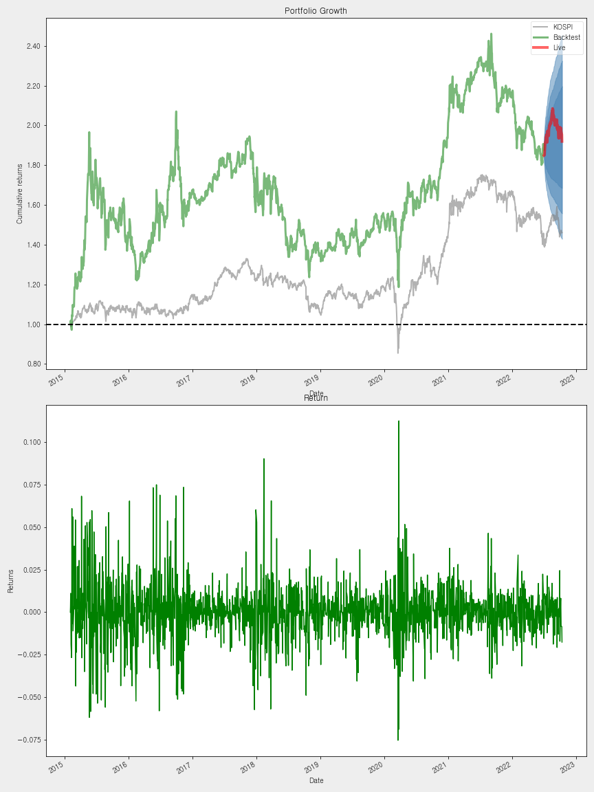

HUG-Portfolio Reports
=====================
  
 
# 

## 01. Portfolio Allocations (2020.1.1~2022.10.10)
  
   
**최적화된 포트폴리오의 샤프 비율, 시장 베타, 최대 손실폭은 다음과 같다.**  
   
1. The Sharpe Ratio of the backtest is (샤프 비율): 1.0744  
2. The market beta of the backtest is (시장 베타): 0.6883  
3. The maxmimum drawdown of the backtest is (최대 손실폭): -0.2678  
   
**현재 시점으로 보유 종목의 최적 배분은 다음과 같다.**
## 
|                    |   Allocations |    Balance |
|:-------------------|--------------:|-----------:|
| KODEX 미국S&P500TR |        0.4665 | 9124244640 |
| KODEX 코스피TR     |        0.247  | 4290349999 |
| SK바이오사이언스   |        0.0313 |  387512499 |
| STX                |        0.013  |  306842689 |
| 고려신용정보       |        0.1038 | 2277303599 |
| 삼성전자           |        0.0525 |  934043999 |
| 씨티케이           |        0.0054 |  101950290 |
| 아프리카TV         |        0.0028 |   44092000 |
| 카카오페이         |        0.0561 |  626883300 |
| 피씨엘             |        0.006  |   69825859 |
| 한탑               |        0.0157 |  199316039 |
| 현금               |        0      |   -1615419 |

### 

#### [표 1] 최적 포트폴리오 배분
  
   

#### [그림 1] 최적 포트폴리오 배분 파이 차트
  
 
## 02. 포트폴리오 성과 통계량 요약
  
   
포트폴리오 전체 기간에 대한 측정 항목 및 통계량은 다음과 같다.
## 
|                                  | 성과 통계량        |
|:---------------------------------|:-------------------|
| 연간 수익률 (Annual return)      | 19.491%            |
| 누적 수익률 (Cumulative returns) | 48.86%             |
| 연간 변동성 (Annual volatility)  | 18.098%            |
| 샤프 비율 (Sharpe ratio)         | 1.0743790687487182 |
| 칼마 비율 (Calmar ratio)         | 0.7278458106711917 |
| 안정성 (Stability)               | 0.4871871354971548 |
| 최대 손실 폭 (Max drawdown)      | -26.779%           |
| 오메가 비율 (Omega ratio)        | 1.1936507988286276 |
| 솔티노 비율 (Sortino ratio)      | 1.6330162675504678 |
| 왜도 (Skew)                      | 0.2934547166980577 |
| 첨도 (Kurtosis)                  | 2.01522709140019   |
| 테일 비율 (Tail ratio)           | 1.0380308903873063 |
| 일별 VaR (Daily value at risk)   | -2.203%            |

### 

#### [표 2] 포트폴리오 성과 통계표
  
   

#### [그림 2] 포트폴리오 성과 통계 도표
  
 
## 03. 포트폴리오 백테스팅 결과

### 03.1 포트폴리오 Growth & Returns
  
   
벤치마크 대비 포트폴리오의 기간 내 성과는 다음과 같다.
## 

### 
  

#### [그림 3] 포트폴리오의 기간 내 Growth & Returns
  
 
### 03.2 포트폴리오 월/연도별 Returns
  
   
포트폴리오의 연도별 Returns는 다음과 같다.
### 
|      |    Return |
|-----:|----------:|
| 2020 |  0.320745 |
| 2021 |  0.423421 |
| 2022 | -0.208181 |

#### [표 3] 연도별 Returns
  
   
**포트폴리오의 연도별, 월별 Returns를 도식화하면 그림 4와 같으며 좌측 상단부터 시계방향으로 설명하면 다음과 같다.   **  
   
1. 연도별 Returns  
2. 월별 Returns의 분포  
3. 연도-월별 Returns의 막대 그래프  
4. 연도-월별 Returns의 히트맵  
   

#### [그림 4] 월 & 연도별 Returns 도표
  
   
 
### 03.3 포트폴리오 하락 기간과 팩터 노출
  
   
해당 포트의 주요 하락 기간은 다음과 같다.
### 
|    |   Net drawdown in % | Peak date           | Valley date         | Recovery date       |   Duration |
|---:|--------------------:|:--------------------|:--------------------|:--------------------|-----------:|
|  0 |            26.7793  | 2021-09-03 00:00:00 | 2022-07-01 00:00:00 | NaT                 |        nan |
|  1 |             9.90947 | 2020-09-02 00:00:00 | 2020-10-30 00:00:00 | 2020-11-24 00:00:00 |         60 |
|  2 |             6.59021 | 2021-02-16 00:00:00 | 2021-03-09 00:00:00 | 2021-04-02 00:00:00 |         34 |
|  3 |             5.73141 | 2021-01-25 00:00:00 | 2021-01-29 00:00:00 | 2021-02-16 00:00:00 |         17 |
|  4 |             4.77639 | 2021-05-10 00:00:00 | 2021-05-24 00:00:00 | 2021-06-03 00:00:00 |         19 |

#### [표 4] Top 5 하락 기간
  
   
**포트폴리오의 연도별, 월별 Returns를 도식화하면 그림 4와 같으며 좌측 상단부터 시계방향으로 설명하면 다음과 같다.   **  
   
1. Top 5 손실 기간   
2. 롤링 포트폴리오 베타  
3. Underwater Plot  
4. 롤링 샤프 비율 (6개월)  
   

#### [그림 5] 시간 경과에 따른 하락 기간 및 팩터 노출 그래프
  
 